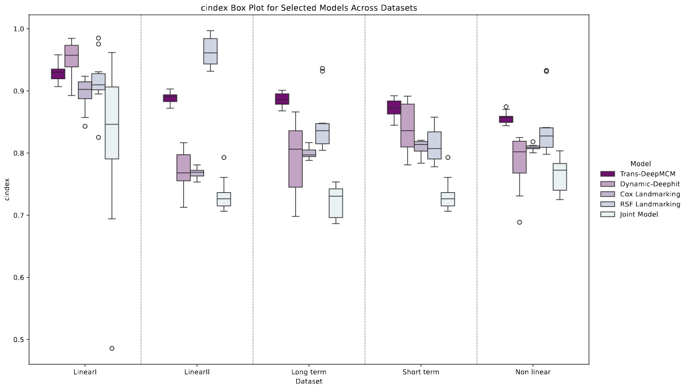
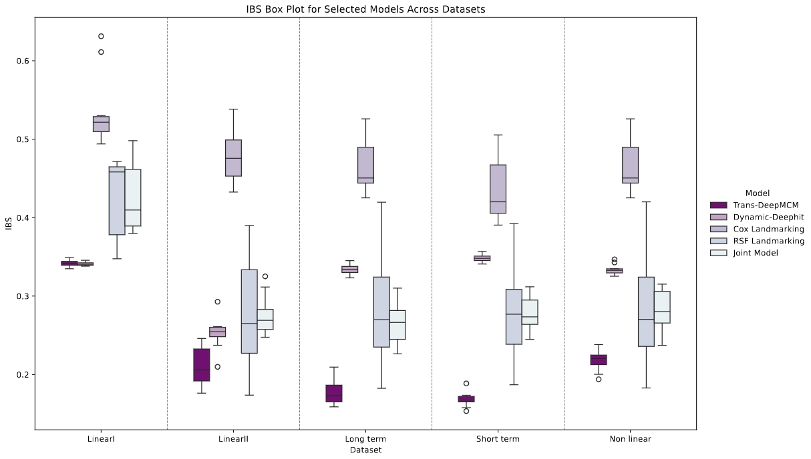
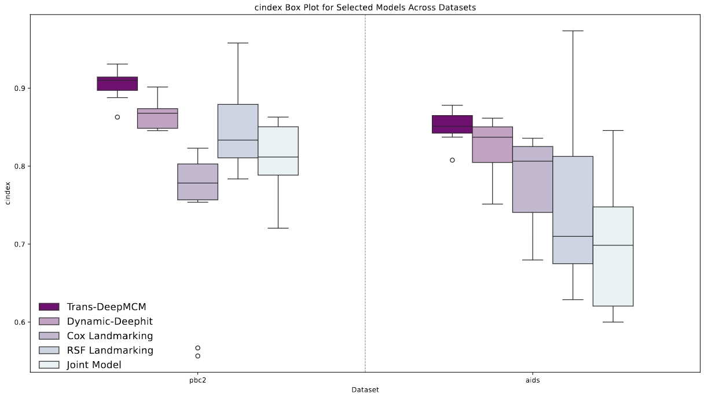
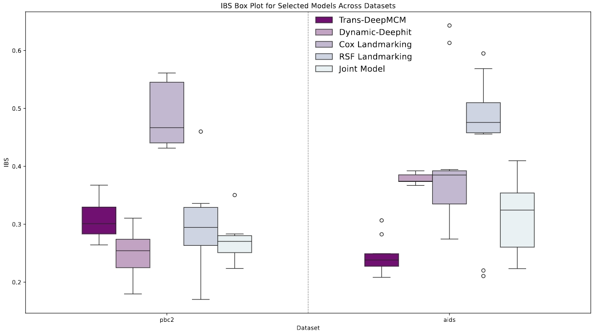

# 🚀 Welcome to **Trans-DeepMCM** 🎯  

Follow these steps to use **Trans-DeepMCM** effectively! 😀  

---
# 1️⃣ **Part I : Usage Instructions** 🔧 
## 🛠 **Step 1: Prepare Longitudinal Data 📊**  
Ensure your data is **longitudinal**. Use `Trans-Dynamic_Network` to extract longitudinal features into a static vector, **c**.  

👉 **Update the data input logic** in `import_data.py` according to your data format.  
👉 **Modify `data_mode`** in `main.py` if necessary.  
👉 **Set up the storage path** for the static data (CSV).  

---

## 🔬 **Step 2: Survival Analysis with DeepMCM ⏳**  
Use the extracted **static vector** c for **survival analysis** in `DeepMCM`.  

📌 **For new data**: Create a `config.ini` (a sample is included in the code package).  
📌 **Optimize hyperparameters** using `hyperpara_search.py`, or start with the **default parameters** for initial testing.  
📌 **Run multiple configurations** in `main.py` to obtain results for different datasets.  

---

## ⚙️ **Installation** 🛠️  
To set up your environment for **Trans-DeepMCM**, install the required libraries listed in `requirements.txt`:  
- numpy==2.1.3
- pandas==2.2.3
- scikit_learn==1.5.2
- torch==2.2.2+cu121
- tqdm==4.66.1
- lifelines==0.30.0
- optuna==3.6.1
- prettytable==3.12.0

💻 **Run the following command** to install dependencies:  
```bash
pip install -r requirements.txt
```  

---

#  2️⃣ **Part II : Model Performance** 📊  
The following tables and figures present the **C-index** and **IBS** results of various models across simulated and real-world datasets.


### **📌 Table 1: C-index of models across simulated datasets**
| Model  | Data I            | Data II           | Data III           | Data IV            | Data V             |
|--------|------------------|------------------|------------------|------------------|------------------|
| **TDMCM(Ours)**  | 0.9360 (0.0253)  | 0.8886 (0.0083)  | **0.8570 (0.0092)**  | **0.8720 (0.0142)**  | **0.8756 (0.0110)**  |
| **DDHit**  | **0.9529 (0.0268)** *  | 0.7762 (0.0443) ***  | 0.7885 (0.0704) ***  | 0.8406 (0.0390)  | 0.7911 (0.0577) ***  |
| **CoxLM**  | 0.8958 (0.0127) **  | 0.7693 (0.0046) ***  | 0.8073 (0.0038) ***  | 0.8097 (0.0060) ***  | 0.8004 (0.0096) ***  |
| **RSFLM**  | 0.9180 (0.0417)  | **0.9637 (0.0228)** ***  | 0.8467 (0.0460) *  | 0.8126 (0.0300) ***  | 0.8520 (0.0442) *  |
| **JM**  | 0.8169 (0.1337) *  | 0.7309 (0.0348) ***  | 0.7653 (0.0254) ***  | 0.7327 (0.0252) ***  | 0.7221 (0.0245) ***  |

---

### **📌 Table 2: IBS of models across simulated datasets**
| Model  | Data I            | Data II           | Data III           | Data IV            | Data V             |
|--------|------------------|------------------|------------------|------------------|------------------|
| **TDMCM(Ours)**  | 0.3420 (0.0042)  | **0.2093 (0.0245)**  | **0.2184 (0.0131)**  | **0.1678 (0.0091)**  | **0.1781 (0.0165)**  |
| **DDHit**  | **0.3411 (0.0023)**  | 0.3457 (0.0118) **  | 0.3477 (0.0069) ***  | 0.3484 (0.0048) ***  | 0.3340 (0.0059) ***  |
| **CoxLM**  | 0.5387 (0.0486) ***  | 0.4750 (0.0298) ***  | 0.4596 (0.0316) ***  | 0.4356 (0.0279) ***  | 0.4596 (0.0316) ***  |
| **RSFLM**  | 0.4393 (0.0506) ***  | 0.2823 (0.0788)  | 0.2856 (0.0798) *  | 0.2796 (0.0653) ***  | 0.2856 (0.0804) **  |
| **JM**  | 0.4343 (0.0449) ***  | 0.2758 (0.0239) ***  | 0.2823 (0.0242) ***  | 0.2777 (0.0203) ***  | 0.2660 (0.0272) ***  |

---

### **📌 Table 3: C-index and IBS values of models on PBC2 and AIDS datasets**
| Model                 | C-index (PBC2)        | C-index (AIDS)        | IBS (PBC2)        | IBS (AIDS)        |
|-----------------------|---------------------|---------------------|------------------|------------------|
| **Trans-DeepMCM**      | **0.9053 (0.0186)**  | **0.8506 (0.0190)**  | 0.3090 (0.0319)  | **0.2455 (0.0276)**  |
| **Dynamic-DeepHit**    | 0.8659 (0.0178) **  | 0.8252 (0.0348)  | 0.6382 (0.0241) ***  | 0.3780 (0.0086) ***  |
| **Cox Landmarking**    | 0.7438 (0.0934) ***  | 0.7809 (0.0548) ***  | 0.4945 (0.0559) ***  | 0.4276 (0.1108) ***  |
| **RSF Landmarking**    | 0.8776 (0.0709) *  | 0.7394 (0.1058) *  | 0.2886 (0.0759)  | 0.4384 (0.1244) *  |
| **Joint Model**        | 0.8081 (0.0475) ***  | 0.6958 (0.0789) ***  | **0.2711 (0.0321)** **  | 0.3058 (0.0590) *  |

---

Below are the C-index and IBS performance visualizations across different datasets. These figures illustrate the comparative effectiveness of various models in both simulated and real-world scenarios.

📌 Simulated Dataset Results:




📌 Real-World Dataset Results (PBC2 & AIDS):




---

# 3️⃣ **Part III : Supplements & Notes** 📢  
- 💡 As my main focus is on **dynamic survival analysis**, there is a **specific workflow** for this purpose. If you need the **dynamic joint training code**, feel free to **contact me**! 📩  
- 💡 The **DeepMCM** model can also be directly used for **static survival analysis**. Just follow **Step 2** above and **set up a config** for your data.  
- 💡 Note: This model was created and submitted by me in November 2024 as part of a research project.

---

# 🔥 **Happy modeling!** 💡🎯  

